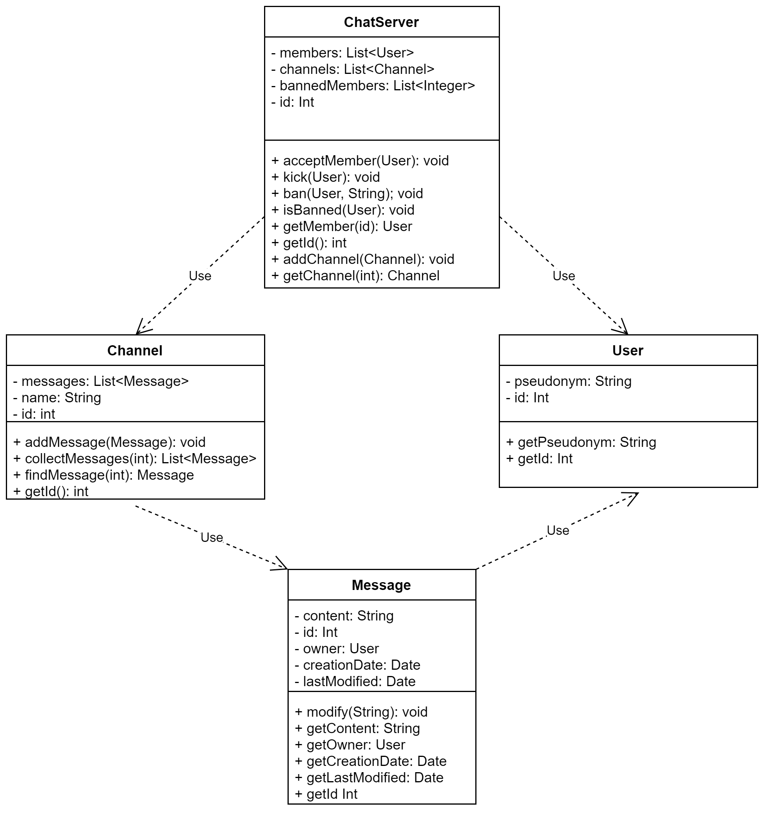

 (counter since 3 march 2021)

 <h1>The Linkit Framework</h1> 
  

A framework to quickly create the network side of an application.
Linkit is a framework that handles the network side of an application,  
allowing it to share objects between the server and its clients. 
Shared objects can be converted into "Connected Objects" 
in which method calls can be triggered according to a defined contract amongst actual and distant versions of the connected object.
This special handling is available for instances of any public / non-final classes, .

## Some Examples
this readme will introduce the functionality of "connected objects",
but the other features available are treated in the WIKI. 

### simple example of a chatting application
Let's say we want to create an online chat application in the Scala language.  
We will assume that it is a graphical application, with servers, containing members and channels, in which members can send text messages (like Discord).

Here is our class architecture: 

